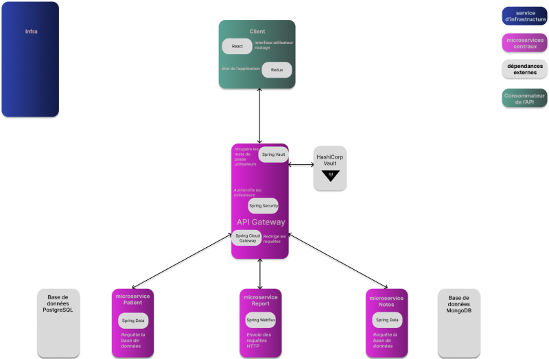

[FR](#microservice-report) | [EN](#report-microservice)
# Microservice Report

## Architecture
Ce microservice fait partie d'une application de gestion de données médicales et démographiques permettant d'obtenir des rapports de risques de diabète en fonction des profils des patients et des constatations médicales les concernant.   

Il s'intègre à l'application avec d'autres microservices :
 - [API Gateway](https://github.com/divineion/abernathyclinic-gateway) pour l'authentification et le routage.    
 - [Microservice Patient](https://github.com/divineion/abernathyclinic-patient) pour la gestion des données démographiques des patients.  
 - [Microservice Notes](https://github.com/divineion/abernathyclinic-notes) pour la gestion des données médicales.  
 - [Infrastructure](https://github.com/divineion/abernathyclinic-infra) pour l'orchestration Docker.   
 - [Interface utilisateur](https://github.com/divineion/abernathyclinic-client) pour l'interface web de gestion des fiches patients et la consultation des rapports de risque.  
 
   

## 1. Rôle
Ce microservice stateless agrège de manière réactive les données démographiques du service Patient et les données textuelles du service Notes et analyse la fréquence d'apparition de termes significatifs prédéfinis pour évaluer le niveau de risque de diabète d'un patient (`NONE`, `BORDERLINE`, `IN_DANGER`, `EARLY_ONSET`).

## 2. Choix techniques
 - Langage : **Java 24**   
 - Framework : **Spring Boot** (Spring WebFlux)   
 - Tests d'intégration : **Wiremock**   
 - Conteneurisation : **Docker**    
 
## 3. Configuration
Le fichier `application.properties` comporte les propriétés de connexion aux autres services et les variables d'environnement correspondantes pour l'environnement Docker.  

`server.port` | port d'écoute du service | `8084`   
`patient.service.url` | URL d'accès à l'API Patient | `${MICROSERVICE_PATIENT_URL:http://localhost:8080/patient/}`   
`notes.service.url` | URL d'accès à l'API Notes | `${MICROSERVICE_NOTES_URL:http://localhost:8080/notes/}`   

## 4. Principaux endpoints
Les interactions s'appuient sur l'architecture réactive (`Mono` et `Flux`). 

GET `/api/report/{uuid}` : génère et retourne le niveau de risque de diabète calculé pour un patient ciblé par son UUID. 

## 5. Démarrage rapide
### Prérequis
 - Java 24
 - Maven 3.x
 - [API Gateway](https://github.com/divineion/abernathyclinic-gateway) démarrée 
 - [Microservice Patient](https://github.com/divineion/abernathyclinic-patient) démarré  
 - [Microservice Notes](https://github.com/divineion/abernathyclinic-notes) démarré  
 
### Lancer le service
```
mvn spring-boot:run
```

Le service démarre avec la configuration par défaut (application.properties) et écoute sur le port 8084.  

[EN](#report-microservice) | [FR](#microservice-report)
# Report Microservice

## Architecture
This stateless microservice is part of a medical and demographic data management application designed to assess health risk reports based on patient profiles and medical observations.   

It integrates with the following microservices:
 - [API Gateway](https://github.com/divineion/abernathyclinic-gateway) for routing, security, and authentication.   
 - [Microservice Patient](https://github.com/divineion/abernathyclinic-patient) for managing patient demographic data.   
 - [Microservice Notes](https://github.com/divineion/abernathyclinic-notes) to retrieve clinical observation notes.   
 - [Infrastructure](https://github.com/divineion/abernathyclinic-infra) for Docker container orchestration.   
 - [User Interface](https://github.com/divineion/abernathyclinic-client) web interface for managing patient records and viewing risk reports.   
 


## 1. Role
This stateless microservice reactively aggregates demographic data from the Patient service and medical notes from the Notes service, scans for predefined medical trigger keywords to determine a patient's diabetes risk level (`NONE`, `BORDERLINE`, `IN_DANGER`, `EARLY_ONSET`).

## 2. Technical Stack
 - Language: **Java 24**   
 - Framework: **Spring Boot** (Spring WebFlux)   
 - Integration testing: **Wiremock**   
 - Containerization: **Docker**   

## 3. Configuration
Docker environment variables and connection properties are defined in `application.properties`. 

`server.port` | service port | `8084`   
`patient.service.url` | Patient API endpoint URL | `${MICROSERVICE_PATIENT_URL:http://localhost:8080/patient/}`   
`notes.service.url` | Notes API endpoint URL | `${MICROSERVICE_NOTES_URL:http://localhost:8080/notes/}` 

## 4. Main endpoints
Interactions are based on a reactive model (`Mono` and `Flux`). 

GET `/api/report/{uuid}` : generates and returns the diabetes risk level for the specified patient UUID.

## 5. Quickstart
### Prerequisites
 - Java 24
 - Maven 3.x
 - Running [API Gateway](https://github.com/divineion/abernathyclinic-gateway)   
 - Running [Microservice Patient](https://github.com/divineion/abernathyclinic-patient)  
 - Running [Microservice Notes](https://github.com/divineion/abernathyclinic-notes)  
 
### Run the Microservice
```
mvn spring-boot:run
```

The service listens on port 8084.  